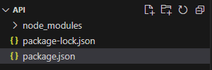
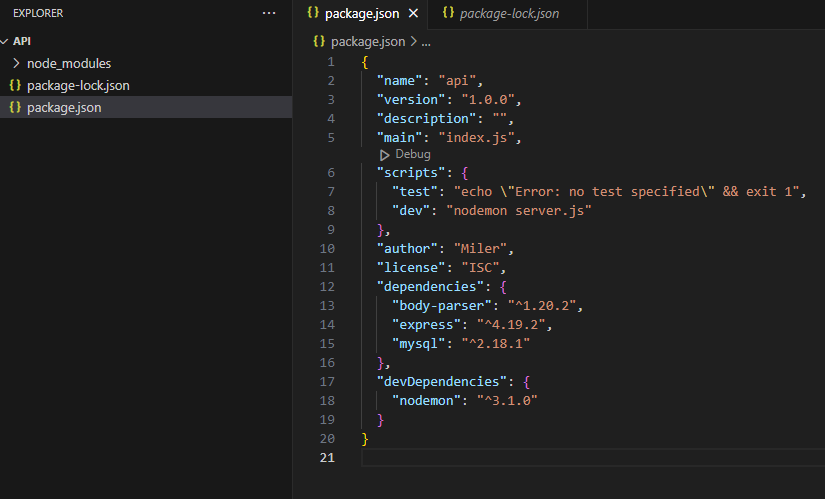

# API Básica con nodejs
Aquí estoy demostrando cómo usar una API desde cero, con una base de datos propia y otras dependencias importantes.


## Dependencias

- express 

    Esto es una dependencia importante para nuestra API.

    Se instala con el siguiente comando:
    ```
    npm install --save express
    ```

- nodemon 

    Sirve para no tener que reiniciar el servicio manualmente cada vez. 

    Se instala con el siguiente comando:
    ```
    npm install --save-dev nodemon
    ```

    Se ejecuta con:
    ```
    nodemon [direccion_archivo]
    ```

- morgan 

    Sirve para ver información de las peticiones realizadas a la API dentro de la consola. 

    Se instala con el siguiente comando:
    ```
    npm install --save morgan
    ```

- body-parser 

    Sirve para formatear el código de una forma más legible, como por ejemplo JSON. 

    Se instala con el siguiente comando:
    ```
    npm install --save-dev body-parser
    ```

- mariadb 

    Yo he estado utilizando mariadb como base de datos, por lo que tendríamos que instalar su dependencia también. 

    Se instala con el siguiente comando:
    ```
    npm install mariadb
    ```

 

Todas estas dependencias se pueden instalar con un comando conjunto: 

```
npm install express morgan body-parser nodemon mariadb --save
```

 

 

## Iniciar la API

Para generar el proyecto por primera vez tendremos que usar el comando de abajo. Este comando nos genera una serie de preguntas para generar el proyecto, y  generar con él el archivo principal, al cual le podemos poner el nombre que queramos. 

 
```
npm init
```

 

Este comando nos creará esta serie de preguntas, de las cuales, muchas podemos dejar en blanco. 

>package name: (api)  
>version: (l.ø.ø)  
>description :  
>entry point: (index.js)  
>test command:  
>git repository:  
>keywords :  
>author: miler  
>license: (ISC)  
 

Nos dejará estos archivos: 


 

 

Para iniciar la API tenemos que ejecutar el siguiente comando: 

 
```
Node [ruta_archivo]
```

 

Este comando seguirá ejecutándose hasta que nosotros decidamos terminar el comando con Crtl + C. Los cambios no se guardarán hasta que reiniciemos el proyecto de forma manual, por lo que aquí nos sirve la herramienta nodemon, que abajo tenemos para usar nodemon, y que éste nos reinicie el servidor de forma automatizada cada vez que hagamos cambios en nuestro código (incluso otros archivos que cuelgan del principal). 

 
```
nodemon [ruta_archivo] 
```
 

Este comando es para que cuando actualizamos el archivo de forma indirecta, siga pillando los cambios y reinicie la API. 

 
```
tsc --watch 
```
 


## Otros apuntes (desuso)

 

He añadido esta línea, que lanza nuestro servidor y ejecuta el comando especificado (nodemon server.js) 

 

>dev": "nodemon server.js




Este comando nos inicia la api:

```
npm run dev
```
 